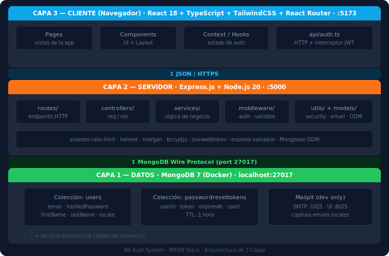
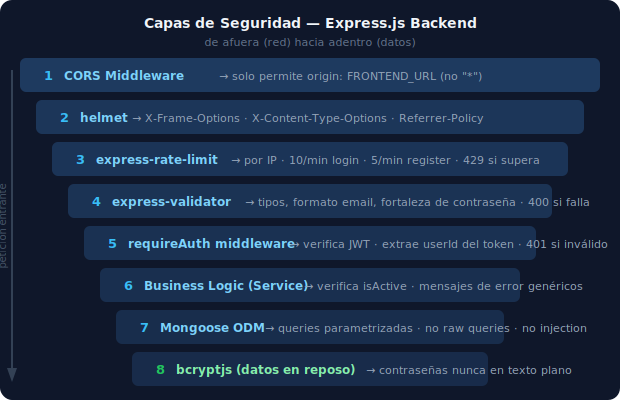

# Arquitectura del Sistema — NN Auth System

<!--
  ¿Qué? Documentación de la arquitectura general del sistema NN Auth System.
  ¿Para qué? Que cualquier desarrollador entienda cómo interconectan los módulos,
             capas y responsabilidades antes de leer el código fuente.
  ¿Impacto? Sin este documento, un desarrollador nuevo tardaría horas en entender
             por qué el código está estructurado así y cuál es el flujo de cada operación.
             Este documento reduce significativamente el tiempo de onboarding.
-->

> **Proyecto**: NN Auth System
> **Stack**: Express.js (Node.js 20) + React (TypeScript) + MongoDB 7 + Docker

---

## Vista General del Sistema

El sistema sigue una **arquitectura Cliente–Servidor de 3 capas**, donde cada capa tiene
una responsabilidad única y se comunica solo con la capa adyacente:



---

## Arquitectura del Backend (`be/`)

### Estructura de capas

```
be/src/
│
├── index.ts         ← Punto de entrada: arranca el servidor HTTP
├── app.ts           ← Express app: middleware global, CORS, helmet, morgan, routers
│
├── config/          ← CONFIGURACIÓN
│   └── env.ts       ← Variables de entorno validadas con envalid (falla si faltan)
│
├── db/              ← BASE DE DATOS
│   └── connection.ts ← Conexión Mongoose a MongoDB
│
├── routes/          ← CAPA DE PRESENTACIÓN (HTTP)
│   ├── auth.routes.ts  ← POST /register, /login, /refresh, /change-password,
│   │                      /forgot-password, /reset-password
│   └── users.routes.ts ← GET /me
│
├── controllers/     ← MANEJADORES HTTP (req → service → res)
│   ├── auth.controller.ts
│   └── users.controller.ts
│
├── services/        ← CAPA DE LÓGICA DE NEGOCIO
│   └── auth.service.ts  ← register, login, refreshToken, changePassword,
│                           forgotPassword, resetPassword
│
├── middleware/      ← MIDDLEWARE DE EXPRESS
│   ├── auth.middleware.ts     ← requireAuth: verifica JWT, adjunta user al req
│   └── validate.middleware.ts ← ejecuta reglas de express-validator → 400 si falla
│
├── models/          ← CAPA DE DATOS (Mongoose)
│   ├── User.ts                ← Schema + interfaz IUser
│   └── PasswordResetToken.ts  ← Schema + interfaz IPasswordResetToken
│
└── utils/           ← UTILIDADES TRANSVERSALES
    ├── security.ts  ← hashPassword, verifyPassword, signToken, verifyToken
    └── email.ts     ← sendPasswordResetEmail (nodemailer + Mailpit)
```

### Flujo de una petición HTTP

```
1. Cliente envía:     POST /api/v1/auth/login { email, password }
                      ↓
2. express-rate-limit: verifica si la IP superó 10/min
                      Si sí → 429 Too Many Requests
                      ↓
3. validate middleware: express-validator comprueba email y password
                      Si falla → 400 Bad Request con detalle de errores
                      ↓
4. Controller:         auth.controller.ts::login() delega al service
                      ↓
5. Service:            auth.service.ts::login():
                      - User.findOne({ email })
                      - bcrypt.compare(password, user.hashedPassword)
                      - verifica isActive
                      - jwt.sign() → accessToken + refreshToken
                      - logSecurityEvent('login_success', ...)
                      ↓
6. Response:           { accessToken, refreshToken, tokenType: 'bearer' }
```

### Seguridad en el backend



---

## Arquitectura del Frontend (`fe/`)

### Estructura de capas

```
fe/src/
│
├── main.tsx         ← Punto de entrada: renderiza <App /> en el DOM
├── App.tsx          ← Rutas de la aplicación (React Router)
├── index.css        ← Estilos globales + imports de TailwindCSS
├── i18n.ts          ← Configuración de i18next (ES + EN)
│
├── context/         ← ESTADO GLOBAL
│   └── AuthContext.tsx ← Provider: usuario actual, tokens, loading + hook useAuth
│
├── hooks/           ← LÓGICA REUTILIZABLE
│   └── useAuth.ts   ← Acceso al contexto de auth desde cualquier componente
│
├── api/             ← COMUNICACIÓN HTTP
│   └── auth.ts      ← register, login, refresh, changePassword, forgotPassword,
│                      resetPassword + instancia Axios con interceptores JWT
│
├── components/      ← COMPONENTES REUTILIZABLES
│   ├── ProtectedRoute.tsx  ← Guarda de rutas autenticadas
│   ├── layout/
│   │   ├── AuthLayout.tsx      ← <main> landmark para páginas de auth
│   │   ├── Navbar.tsx          ← Barra de navegación, theme toggle, language switcher
│   │   └── LegalLayout.tsx     ← Layout compartido para páginas legales
│   └── ui/
│       ├── Button.tsx          ← Botón con estado loading (aria-busy)
│       ├── InputField.tsx      ← Input con label, validación y a11y
│       ├── Alert.tsx           ← Mensajes de éxito/error/info
│       └── LanguageSwitcher.tsx ← Toggle ES/EN (aria-pressed)
│
├── pages/           ← VISTAS (una por ruta)
│   ├── LandingPage.tsx
│   ├── LoginPage.tsx
│   ├── RegisterPage.tsx
│   ├── DashboardPage.tsx
│   ├── ChangePasswordPage.tsx
│   ├── ForgotPasswordPage.tsx
│   ├── ResetPasswordPage.tsx
│   ├── ContactPage.tsx
│   ├── TerminosDeUsoPage.tsx
│   ├── PoliticaPrivacidadPage.tsx
│   └── PoliticaCookiesPage.tsx
│
├── locales/         ← TRADUCCIONES (i18n)
│   ├── es/translation.json
│   └── en/translation.json
│
└── types/           ← TIPOS TYPESCRIPT
    └── auth.ts      ← LoginRequest, RegisterRequest, UserResponse, TokenResponse, etc.
```

### Rutas de la aplicación

```
/                   → LandingPage (pública)
/login              → LoginPage (pública)
/register           → RegisterPage (pública)
/forgot-password    → ForgotPasswordPage (pública)
/reset-password     → ResetPasswordPage (pública, requiere ?token=...)
/contacto           → ContactPage (pública)
/terminos-de-uso    → TerminosDeUsoPage (pública)
/privacidad         → PoliticaPrivacidadPage (pública)
/cookies            → PoliticaCookiesPage (pública)
/dashboard          → DashboardPage (PROTEGIDA — requiere auth)
/change-password    → ChangePasswordPage (PROTEGIDA — requiere auth)
```

### Flujo de autenticación en el frontend

```
Arranque de la app:
1. AuthContext se monta → lee access_token de memoria (no localStorage)
2. Si hay token → verifica con GET /api/v1/users/me
3. Si 200 → usuario autenticado, redirecciona a /dashboard
4. Si 401 → intenta refresh con POST /api/v1/auth/refresh
5. Si refresh falla → usuario va a /login

Login exitoso:
1. LoginPage → auth.login(email, password) → TokenResponse
2. AuthContext guarda tokens en memoria (no localStorage por seguridad)
3. GET /api/v1/users/me → guarda perfil en estado
4. React Router navega a /dashboard

Acceso a ruta protegida sin token:
1. <ProtectedRoute> detecta que no hay usuario autenticado
2. Muestra spinner (role="status") mientras verifica
3. Si no autenticado → <Navigate to="/login" />

Expiración del access_token (15 min):
1. Axios interceptor detecta 401 en respuesta
2. Automáticamente llama POST /api/v1/auth/refresh
3. Si refresh exitoso → reintenta la petición original
4. Si refresh falla → logout + redirect a /login
```

---

## Flujos de Autenticación de Extremo a Extremo

### Flujo 1 — Registro

```
Usuario                  Frontend (React)            Backend (Express)
   │                           │                             │
   │ Rellena formulario        │                             │
   │ ─────────────────────────►│                             │
   │                           │ POST /auth/register         │
   │                           │────────────────────────────►│
   │                           │                             │ 1. express-validator
   │                           │                             │ 2. Verifica email ∄
   │                           │                             │ 3. bcrypt.hash()
   │                           │                             │ 4. User.create()
   │                           │◄────────────────────────────│
   │ Ve mensaje de éxito        │  201 UserResponse           │
   │◄──────────────────────────│                             │
```

### Flujo 2 — Login y Acceso a Dashboard

```
Usuario           Frontend                Backend               MongoDB
   │                 │                       │                       │
   │ email+password  │                       │                       │
   │────────────────►│                       │                       │
   │                 │ POST /auth/login       │                       │
   │                 │──────────────────────►│                       │
   │                 │                       │ SELECT * FROM users   │
   │                 │                       │ WHERE email = $1 ────►│
   │                 │                       │◄──────────────────────│
   │                 │                       │ verify_password()     │
   │                 │                       │ create_access_token() │
   │                 │                       │ create_refresh_token()│
   │                 │◄──────────────────────│                       │
   │                 │ 200 TokenResponse     │                       │
   │                 │ (access+refresh)      │                       │
   │                 │                       │                       │
   │                 │ GET /users/me         │                       │
   │                 │ Authorization: Bearer │                       │
   │                 │──────────────────────►│                       │
   │                 │                       │ decode_token()        │
   │                 │                       │ SELECT user by id ───►│
   │                 │◄──────────────────────│                       │
   │ Dashboard carga │ 200 UserResponse      │                       │
   │◄────────────────│                       │                       │
```

### Flujo 3 — Recuperación de Contraseña

```
Usuario           Frontend                Backend               MongoDB       Email
   │                 │                       │                       │           │
   │ Ingresa email   │                       │                       │           │
   │────────────────►│ POST /auth/forgot-password                    │           │
   │                 │──────────────────────►│                       │           │
   │                 │                       │ Busca user por email─►│           │
   │                 │                       │ (si no existe, retorna │           │
   │                 │                       │  respuesta genérica)  │           │
   │                 │                       │ Crea PasswordResetToken           │
   │                 │                       │──────────────────────────────────►│
   │"Revisa tu email"│◄──────────────────────│                       │  Envía mail
   │◄────────────────│ 200 (siempre igual)   │                       │           │
   │                 │                       │                       │           │
   │ Clic en link    │                       │                       │           │
   │────────────────►│ POST /auth/reset-password { token, new_pass } │           │
   │                 │──────────────────────►│                       │           │
   │                 │                       │ Valida token ────────►│           │
   │                 │                       │ hash(new_password)    │           │
   │                 │                       │ UPDATE users password │           │
   │                 │                       │ UPDATE token used=true│           │
   │ "Contraseña restablecida"◄──────────────│                       │           │
   │◄────────────────│ 200 MessageResponse   │                       │           │
```

---

## Decisiones Técnicas Clave

### ¿Por qué Express.js y no NestJS o Fastify?

| Criterio             | Express.js                | NestJS              | Fastify                 |
| -------------------- | ------------------------- | ------------------- | ----------------------- |
| Madurez              | ✅ El más maduro (2010)   | Reciente (2017)     | Reciente (2016)         |
| Curva de aprendizaje | Muy baja                  | Alta (decoradores)  | Media                   |
| Flexibilidad         | ✅ Máxima                 | ⚠️ Opinionado       | ✅ Alta                  |
| TypeScript           | ✅ Soportado con @types   | ✅ Nativo            | ✅ Soportado             |
| Ecosistema npm       | ✅ El mayor               | ✅ Grande            | ✅ Grande                |
| Para aprendizaje     | ✅ Ideal                  | ❌ Complejo          | ✅ Bueno                 |

Express.js fue elegido por ser el estándar de la industria para Node.js: mínimo, explica cada concepto manualmente y tiene el ecosistema más amplio.

### ¿Por qué JWT stateless y no sesiones en servidor?

| Criterio           | JWT Stateless         | Sesiones en servidor                |
| ------------------ | --------------------- | ----------------------------------- |
| Escalabilidad      | ✅ Horizontal fácil   | ❌ Requiere sticky sessions o Redis |
| Estado en servidor | ✅ Ninguno            | ❌ Almacenamiento de sesiones       |
| Revocación         | ❌ Requiere blacklist | ✅ Borrar sesión                    |
| Apropiado para SPA | ✅ Diseñado para esto | ⚠️ Problemas con CORS               |

Para este proyecto educativo, la arquitectura stateless con JWT es la más apropiada — permite escalar horizontalmente sin coordinación entre servidores.

### ¿Por qué React + Vite y no Next.js?

Este es un proyecto de **SPA (Single Page Application)** — toda la navegación ocurre en el cliente. Next.js agrega SSR (Server-Side Rendering) que no es necesario para una app de auth. Vite es más rápido en desarrollo y la configuración es más simple para aprendizaje.

### ¿Por qué TailwindCSS 4?

- Utility-first: clases aplicadas directamente en JSX, sin saltar entre archivos CSS
- Consistencia: la escala de espaciado, colores y tipografía es uniforme
- Dark mode: soporte nativo con variante `dark:`
- Purge automático: solo los estilos usados llegan al bundle de producción

---

## Configuración de Entornos

| Variable          | Desarrollo                   | Producción                                     |
| ----------------- | ---------------------------- | ---------------------------------------------- |
| `NODE_ENV`        | `development`                | `production`                                   |
| `/api/v1/`        | ✅ Disponible                | ✅ Disponible                                  |
| `MONGODB_URI`     | `mongodb://localhost:27017/` | Cluster MongoDB Atlas o servidor propio        |
| `FRONTEND_URL`    | `http://localhost:5173`      | `https://tu-dominio.com`                       |
| `JWT_SECRET`      | Clave de desarrollo (≥32 ch) | Clave aleatoria larga (`openssl rand -hex 64`) |
| `MAIL_HOST`       | `localhost`                  | Servidor SMTP de producción                    |
| `MAIL_PORT`       | `1025` (Mailpit)             | `587` (STARTTLS) o `465` (SSL)                 |

> Ver [be/.env.example](../be/.env.example) para la lista completa de variables.
